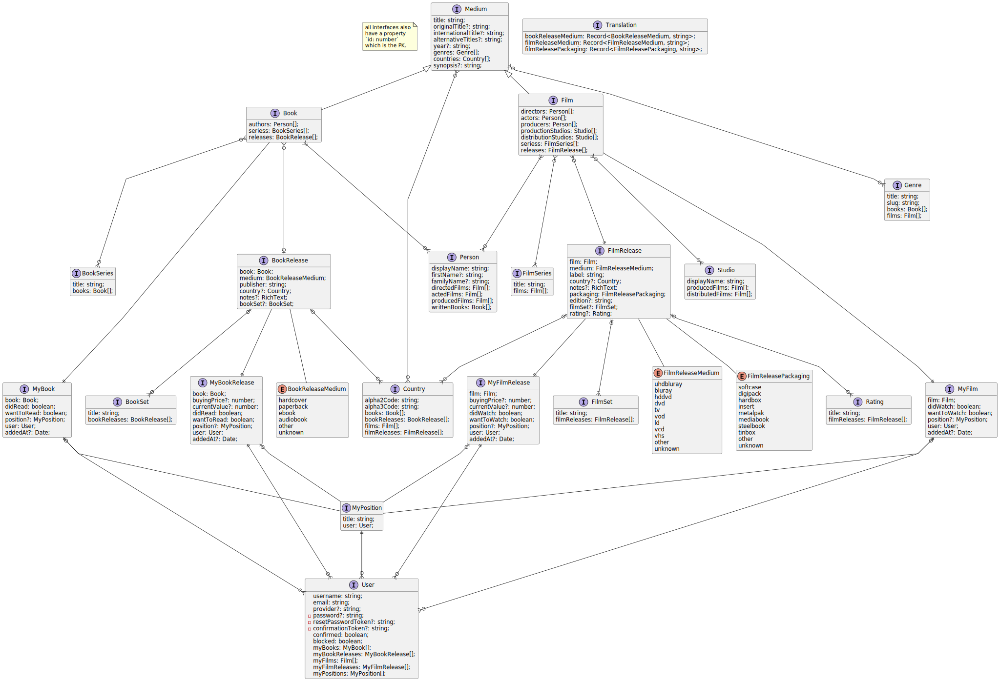

# books-n-films documentation

## ER diagram



## REST API

### Login

POST `/api/auth/local`

Payload:
```
{
  "identifier": "<email>",
  "password": "<password>"
}
```

Response:  
```
{
  "jwt": "<jwt>",
  "user": "<User>"
}
```

For more Details see
[Strapi documentation](https://docs.strapi.io/developer-docs/latest/guides/auth-request.html).

### Content

For detailed documentation about REST API possibilities see
[Strapi documentation](https://docs.strapi.io/developer-docs/latest/developer-resources/database-apis-reference/rest-api.html).

There you will also find how to
[filter](https://docs.strapi.io/developer-docs/latest/developer-resources/database-apis-reference/rest/filtering-locale-publication.html),
[populate and select fields](https://docs.strapi.io/developer-docs/latest/developer-resources/database-apis-reference/rest/populating-fields.html),
[sort and paginate](https://docs.strapi.io/developer-docs/latest/developer-resources/database-apis-reference/rest/sort-pagination.html).

#### Public APIs

`/api/books`  
`/api/book-seriess`  
`/api/book-sets`  
`/api/book-sets`  
`/api/countries`  
`/api/films`  
`/api/film-seriess`  
`/api/film-sets`  
`/api/film-versions`  
`/api/genres`  
`/api/people`  
`/api/ratings`  
`/api/studios`  
`/api/translation`  
`/api/upload/files`

#### Authenticated APIs

All the above, plus:

`/api/my-books`  
`/api/my-book-versions`  
`/api/my-films`  
`/api/my-film-versions`  
`/api/my-positions`
